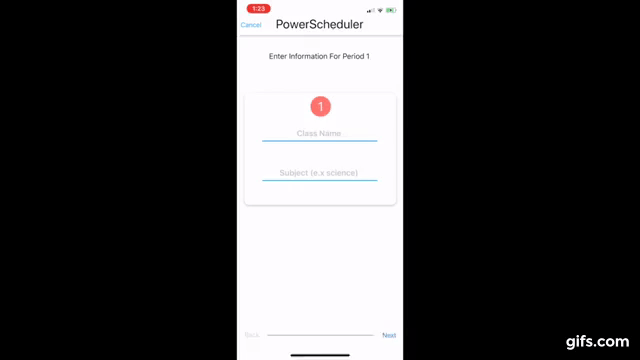

## Problem

Our school uses PowerSchool, a grade management and class scheduling system. However, one feature it seriously lacks is scheduling on mobile.
        	On the mobile app, the method of access most widely used by students, users are presented with a list of classes in place of a schedule. This list of classes does not intuitively represent the period during which each class meets and, more importantly, it does not show students the classes they have on a given day or days in the future.
        	This has frustrated many people who want a simple and effective matrix schedule. It has also made it more difficult for freshmen as they do not know our rotational schedule well.

## Our Solution

Our scheduling app is intuitive and provides greater day to day utility.
#### Overview

#### Setup

Setup of our app is quick and must be done only once a semester. Users simply input their classes into the appropriate periods

